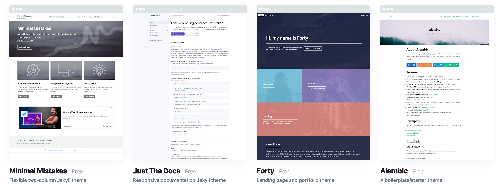

There is a large developer community that has built some very visually appealing templates or "themes" on top of Jekyll.

Samples of these can be found at [Jekyllthemes.io](https://jekyllthemes.io)


  The instructions and code within are current as of 16th May 2025.


